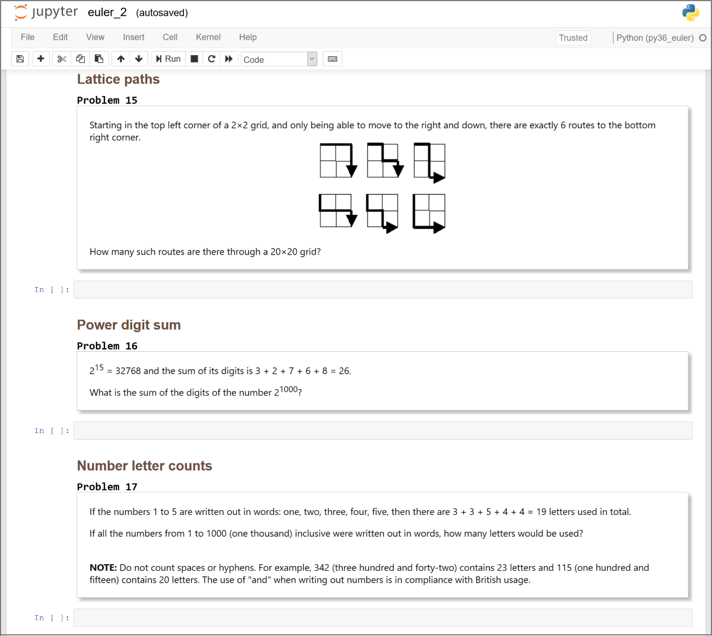

# Project Euler template Jupyter notebooks

The basic idea was to create Jupyter notebooks containing the various
problems found on http://projecteuler.net, allowing for the nicely
formatted problem text (diagrams, mathematical formulae, etc.) to be
available inline with the problem-solving "environment".



The initial set of completed notebooks were seeded using a Python template
but updating for other languages (and of course your own kernels)
is simple.


## [/problems](problems)

### Problems 1 - 100

First 100 problems are available in 10 separate .ipynb files, each
containing a total of 10 problems. Notebooks for the remaining
problems can easily be created by running the Python code beneath `src`.


## [/src](src)

### Creating the notebooks

Requires Python 3.6, though aside from f-strings any 3.x is likely to
work. Additional dependencies may be installed  using:

```
pip install -r src/requirements.txt
```


There are two required arguments to the main *euler_to_jupyter.py*
file:

1) `template-path` = path to a local .ipynb template file.
This local notebook will serve as a source for a few pieces of
info to be incorporated into each generated notebook:
- Jupyter metadata, e.g. kernel specification
- Jupyter file format details
- an initial top cell, to be replicated as first cell in output

One usage pattern for the last item above would involve creating a top
cell in the template .ipynb with a standard set of setup statements,
 e.g. importing key modules in Python or loading base libraries in R.

2) `problem-numbers` = parseable string of problem numbers to retrieve.
Below are examples of acceptable formats:

| Input | Result |
| ------| -----------|
|"1,2,3"|problems 1 through 3|
|"1,2,3,10-15,99"|problems 1 through 3, 10 through 15, and 99|
|"1-3,44,55,101-103"|problems 1 through 3, 44, 55, and 101 through 103|

Generated notebooks will be output to relative *./problems* directory,
with any downloaded images saved to *./problems/images*.

#### sample usage

Pull metadata and first cell from *C:/jupyter/my_py_notebook.ipynb*.
Create one Jupyter notebook with only problems 1, 2, and 3:

```
python src/euler_to_jupyter.py --template-path "C:/jupyter/my_py_notebook.ipynb" --problem-numbers "1,2,3"
```

Pull metadata and first cell from *//Users/arthur/jupyter/my_r_notebook.ipynb*.
Create 5 Jupyter notebooks, first 4 will have 10 problems, last one
will contain problems 41 through 45:

```
python src/euler_to_jupyter.py --template-path "//Users/arthur/jupyter/my_r_notebook.ipynb" --problem-numbers "1-45"
```


